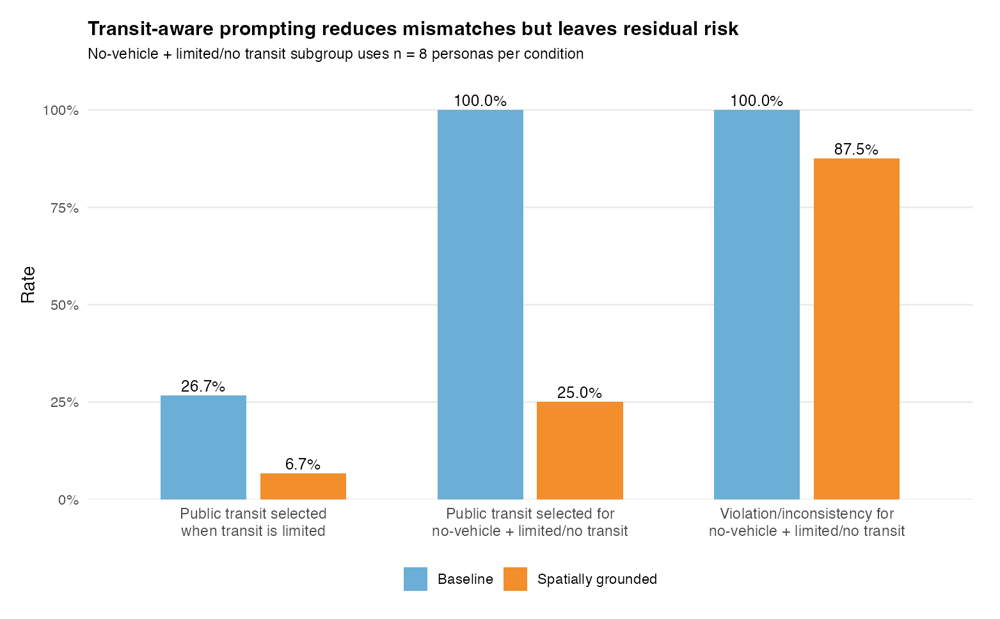

# Evaluating Spatial Feasibility in LLM-Generated Household Evacuation Decisions

**Author:** Jiwoo Hong  
**Affiliation:** University of Wisconsin–Madison  
**Category:** Undergraduate SRC  
**Student authors:** 1  
**Lead student author:** Jiwoo Hong

## Abstract

Large language models (LLMs) can generate fluent household-level evacuation plans, but a plausible plan is not necessarily feasible. Wildfire evacuation depends on transportation access, destination feasibility, hazard exposure, and household constraints. This study evaluates whether LLM-generated household evacuation decisions remain spatially feasible under baseline and spatially grounded prompting.

We generate 200 synthetic household personas calibrated using official ACS tract-level socioeconomic and demographic variables for Los Angeles County. Each persona is paired with approximate spatial risk and distance attributes, including wildfire risk, shelter distance, road travel time, hazard-zone distance, transit access, and neighborhood vulnerability. GPT-4.1-mini produced 400 structured responses across 200 personas and 2 prompting conditions.

Spatially grounded prompting improved selected feasibility metrics: mode feasibility increased from 96.0% to 99.0%, and soft feasibility issues decreased from 4.0% to 1.0%. However, it did not eliminate spatial inconsistency under the current approximate spatial context: spatial inconsistency was 42.5% in baseline and 44.5% in the spatially grounded condition. Transit-aware checks showed a more direct pattern: spatially grounded prompting reduced some public-transit mismatches, but high residual risk remained for no-vehicle households with limited or no transit access. These results suggest that LLM-generated evacuation decisions may sound plausible, but feasibility risks remain for mobility-constrained households.

## 1. Introduction

LLM agents are increasingly used to simulate household decisions in emergency and mobility contexts. Yet evacuation is not only a question of intent or textual plausibility. A generated plan may be infeasible if it assigns private driving to a household with no vehicle, assumes transit access where transit is limited, or recommends a destination without considering distance and mobility constraints.

This paper asks: **Can spatially grounded prompting reduce feasibility risks in LLM-generated household evacuation decisions, and where do risks remain?** Rather than treating LLM outputs as behavioral predictions, we evaluate whether the generated decisions satisfy basic household and spatial constraints. The contribution is both methodological and empirical: a compact feasibility-evaluation framework for LLM-generated evacuation decisions, and an initial finding that feasibility risks are concentrated among no-vehicle households even when spatial context is provided.

## 2. Related Work and Positioning

Existing LLM agent studies often emphasize whether generated behavior is plausible or coherent [2]. Disaster evacuation requires a stricter spatial test: plans must satisfy transportation access, destination feasibility, and local mobility constraints. This study therefore treats LLM outputs not as behavioral ground truth, but as candidates for spatial feasibility evaluation.

## 3. Data and Methods

The study uses 20 Los Angeles County census tract profiles. The tract profiles include official ACS 2023 5-year variables [1]: median household income, no-vehicle household rate, poverty rate, average household size, children share, elderly share, and public transportation commute share. From these profiles, we generate 200 synthetic household personas. The personas are not real households, but are calibrated using official tract-level ACS variables.

Each persona includes household size, income category, vehicle access, caregiving constraints, employment or school obligations, medical needs, and mobility constraints. We attach approximate spatial attributes: wildfire risk category, shelter distance, road travel time to shelter, hazard-zone distance, transit access, and neighborhood vulnerability. These risk and distance fields are approximate study attributes rather than fully integrated GIS measurements.

GPT-4.1-mini is prompted under two conditions. The baseline prompt includes household information only. The spatially grounded prompt adds wildfire risk, shelter distance, travel time, hazard distance, transit access, and neighborhood vulnerability. Each response is constrained to a structured format containing the evacuation decision, transportation mode, destination type, urgency, constraints considered, and reasoning.

We parse each response and apply rule-based feasibility checks. Hard violations capture direct contradictions, such as assigning private-vehicle evacuation to a no-vehicle household. Soft feasibility issues capture lower-confidence concerns, such as hotel selection by low-income households or transit use where transit access is limited. Spatial consistency checks whether reasoning claims, such as "nearby shelter" or "transit is available," match the provided spatial context. This evaluator is not intended to replace operational evacuation modeling [3]. Instead, it provides a lightweight screening layer for identifying obvious contradictions and mobility-sensitive risks before LLM-generated plans are interpreted as feasible evacuation decisions.

## 4. Results

The main experiment produced 400 validated responses: 200 baseline and 200 spatially grounded. Table 1 reports the five metrics used in the SRC submission. In absolute terms, spatially grounded prompting improved mode feasibility by 3.0 percentage points and reduced soft feasibility issues by 3.0 percentage points, while spatial inconsistency increased by 2.0 percentage points. This pattern supports a cautious interpretation: spatially grounded prompting improves selected feasibility metrics but does not eliminate spatial inconsistency under approximate spatial context.

**Table 1. Baseline vs. spatially grounded feasibility metrics.**

| Metric | Baseline | Spatial | Δ |
|---|---:|---:|---:|
| Mode feasibility | 96.0% | 99.0% | +3.0 pp |
| Soft feasibility issue | 4.0% | 1.0% | -3.0 pp |
| Spatial inconsistency | 42.5% | 44.5% | +2.0 pp |
| Mean feasibility score | 0.952 | 0.954 | +0.002 |
| Mean spatial consistency score | 0.894 | 0.887 | -0.007 |

Vehicle access remained an important subgroup: no-vehicle households had much higher risk than vehicle-access households. Figure 1 focuses on transit-related feasibility checks that more directly address whether spatially grounded prompting reduces risks and where risks remain. Spatially grounded prompting reduced public-transit recommendations when transit access was limited, from 26.7% to 6.7%. In the no-vehicle + limited/no transit subgroup, it also reduced public-transit choices from 100.0% to 25.0%, but violation/spatial-inconsistency rates remained high, falling only from 100.0% to 87.5%. Because this subgroup is small (n = 8 personas per condition), these results are treated as exploratory rather than generalizable.

**Figure 1. Transit-aware prompting reduces public-transit mismatches but leaves residual mobility risk.** The no-vehicle + limited/no transit subgroup includes n = 8 personas per condition.

These findings should not be read as evidence that spatial prompting is ineffective. One possible explanation is that spatially grounded prompts encouraged the model to make more explicit spatial claims about shelters, transit access, and travel distance. Because the spatial attributes in this pilot are approximate, these additional claims may have increased the chance of triggering spatial-consistency checks even when mode feasibility improved. For example, some no-vehicle personas were assigned shelter-based evacuation plans despite limited transit access or long estimated shelter travel times. These responses were fluent and policy-relevant in language, but weakly feasible under the provided mobility constraints.

As a small cross-model robustness check, we repeated the evaluation on a 50-persona subset using `gpt-4o-mini`. The no-vehicle risk pattern partially persisted in the spatially grounded subset (26.5% no-vehicle vs. 6.3% vehicle-access), but changed in the baseline subset, suggesting cross-model sensitivity rather than a fully model-invariant effect.

## 5. Limitations and Future Work

For spatial systems, the concern is not only whether an LLM can describe an evacuation plan fluently, but whether that plan can be treated as a feasible mobility decision. This is especially important when generated plans are used in simulation, planning, or decision-support workflows.

This study has four key limitations. First, personas are synthetic, though calibrated using official ACS tract-level variables. Second, spatial risk and distance attributes are approximate; shelter distance, road travel time, hazard distance, and wildfire risk are not yet derived from a full GIS workflow. Third, the experiment has no real evacuation ground truth, so the results evaluate internal feasibility rather than predictive accuracy. Fourth, destination feasibility is evaluated by type rather than verified capacity, opening status, or route availability.

Income was included in persona generation and feasibility rules, but this SRC abstract focuses on mobility feasibility through vehicle and transit access. A fuller analysis of income-related destination equity is left for future work. Future work should integrate verified shelter locations, OpenStreetMap travel times, and wildfire risk surfaces. It should also add uncertainty estimates, significance testing across larger samples, cross-model comparisons with GPT, Gemini, and open-weight LLMs, and expert validation by evacuation planners. Even in its current form, the evaluation highlights a practical warning for LLM-based evacuation simulation: fluent plans can preserve serious feasibility risks, and model choice can affect how strongly those risks appear.

## References

[1] U.S. Census Bureau. 2023. American Community Survey 5-Year Data Profiles.
[2] L. P. Argyle et al. 2023. Out of One, Many: Using Language Models to Simulate Human Samples. *Political Analysis*.
[3] P. Murray-Tuite and B. Wolshon. 2013. Evacuation transportation modeling: An overview of research, development, and practice. *Transportation Research Part C*, 27, 25-45.
